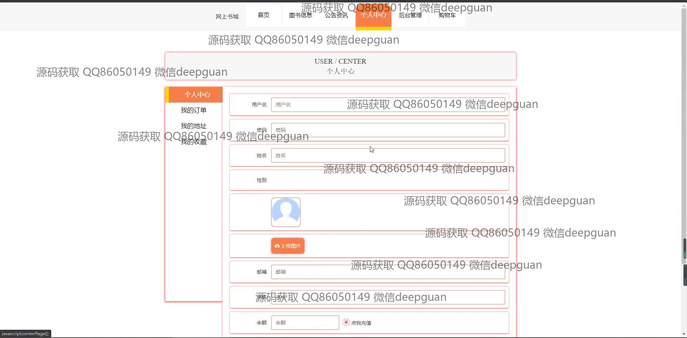
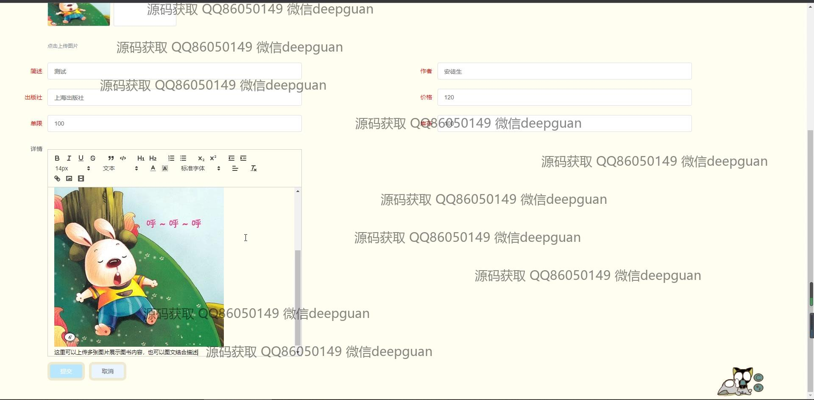
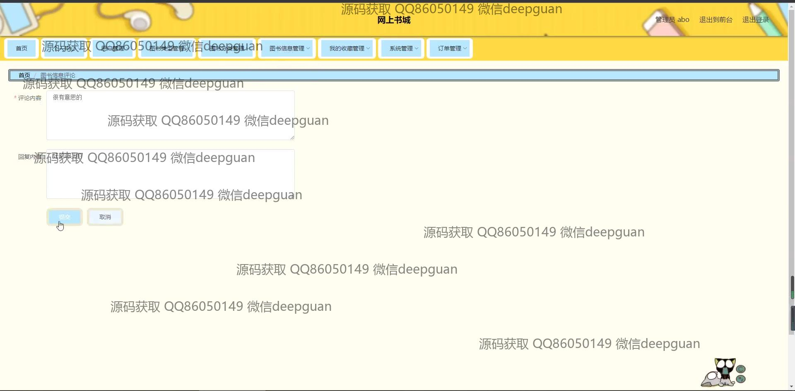

<h1 align="center">网上书城</h1>

## 简介
SpringBoot网上书城：角色分为管理员、用户；支持书籍浏览与购买、用户账户与订单管理、后台管理、书籍信息编辑以及评论管理等功能，实现方便高效的在线书籍销售和管理。    --计算机毕业设计源码；毕设源码；java毕业设计源码

## 联系方式

<h3 align="center">获取完整代码与数据库文件 + 微信：deepguan QQ: 86050149 QQ群: 783742310</h3>

<h3 align="center">可帮忙远程部署 包运行成功！提供远程部署、修改代码、设计文档指导、代码讲解等服务！</h3>

## 功能介绍（完整见运行截图）
用户：用户可以通过网上书城进行书籍的浏览、搜索和购买，管理个人信息和订单记录。用户中心提供个人信息查看与修改、我的订单查询、我的地址和我的收藏功能。此外，还支持购物车管理和多种支付方式的充值操作，用户可以上传头像实现个性化账户管理。 网站首页提供主导航栏和书籍推荐功能，支持通过分类功能筛选不同类型书籍，便于用户快速找到感兴趣的书籍。

管理员：管理员可以对网上书城进行全面管理，包括用户管理、书籍信息管理、订单管理、图书分类管理和系统管理等模块。管理员能够添加、修改和删除书籍信息，包括书籍名称、类别、库存和价格等内容。后台管理还支持书籍评论回复、轮播图管理和订单状态管理，以提升用户体验和订单处理效率。管理员可以通过数据报表分析书籍销量和库存状态，并通过图形化工具进行数据展示。

## 运行截图

本代码来源于网络,仅供学习参考使用!

